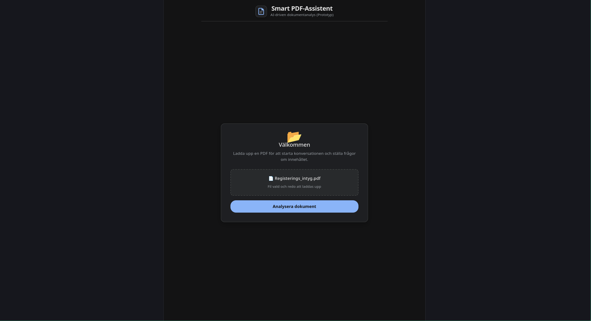
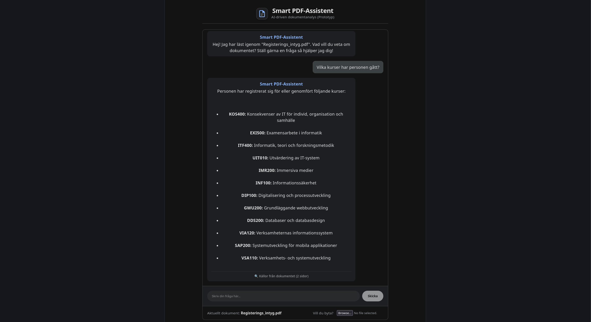
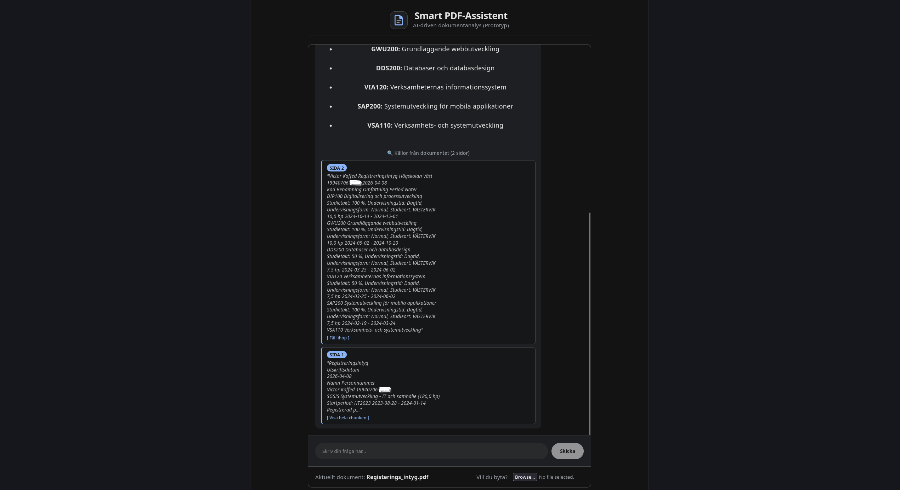

# 📄 Smart PDF-Assistent

En lokal AI-applikation för dokumentanalys (RAG - Retrieval-Augmented Generation) som låter dig ladda upp PDF-filer och ställa interaktiva frågor om deras innehåll. Systemet körs lokalt med hjälp av **Ollama**, **FastAPI** och **React**.

---

## 🚀 Funktioner

* **Lokal:** AI-bearbetning sker lokalt utan att data skickas till externa molntjänster.
* **RAG-flöde:** Extraherar text från PDF:er med **PDFPlumber**, rensar texten med **Regex** och delar upp den i hanterbara textbitar (`chunk_size=2500`), skapar embeddings och sparar i en persistent vektordatabas (**ChromaDB**).
* **AI-drivet Konversationsminne:** Systemet minns tidigare frågor och svar, men för att spara värdefullt VRAM och inte överskrida kontextfönstret, sammanfattar AI:n kontinuerligt äldre historik i bakgrunden.
* **Realtids-streaming (SSE):** Svaren från AI-modellen strömmas ord för ord i realtid från FastAPI till React-klienten via Server-Sent Events, vilket ger en blixtsnabb och interaktiv känsla likt ChatGPT.
* **Sessionshantering:** Använder unika session-IDs (UUID) och in-memory dictionaries för att hantera flera samtidiga användare.
* **Filhantering:** Uppladdade filer döps om till kryptografiska UUIDs och skrivs till disk via optimerade streams (`shutil.copyfileobj`) för att förhindra "Path Traversal" och minnesläckor.
* **Komponentdriven UX:** Frontend är byggt med en ren React-komponentarkitektur. Gränssnittet är inspirerat av moderna AI-plattformar med Markdown-stöd i realtid, automatisk scroll och mjuka CSS-animationer.
* **Källhänvisningar:** Visar exakt vilka sidor och textstycken (chunks) som AI använt för att generera sitt svar, med möjlighet att expandera och läsa hela stycket.

---

### 🎬 Demo
https://github.com/user-attachments/assets/21b88ec2-863a-4fcb-bd2b-c65d951e971a

---

## 📸 Skärmdumpar

### Uppladdningsvy


### Chattgränssnitt


### Källhänvisningar


---

## 🛠️ Teknikstack
* **Backend:** Python, FastAPI, LangChain, ChromaDB, PyPDF
* **Frontend:** React, Vite, React Markdown
* **AI / LLM:** Ollama (t.ex. `gemma4:e4b`) samt embeddings-modell (`bge-m3`)

---

## ⚙️ Installation & Start

Följ dessa steg för att köra projektet lokalt på din maskin.

### Förutsättningar
* [Node.js](https://nodejs.org/) installerat (för frontend).
* [Python](https://www.python.org/) installerat (för backend).
* [Ollama](https://ollama.com/) installerat och igång med dina valda modeller.

---

### 1. Starta Backend (FastAPI)
1. Navigera till mappen `backend/` i terminalen.
2. Skapa och aktivera en virtuell miljö (rekommenderas):
   ```bash
   python -m venv venv
   # Windows:
   venv\Scripts\activate
   # Mac/Linux:
   source venv/bin/activate
   ```
3. Installera alla beroenden:
   ```bash
   pip install -r requirements.txt
   ```
4. Konfigurera miljövariabler:
   Kopiera mallen `.env.example` och skapa en ny fil med namnet `.env`. Anpassa IP-adresser och modellnamn efter din lokala setup.
5. Starta servern:
   ```bash
   uvicorn main:app --reload
   ```

### 2. Starta Frontend (React)
1. Öppna en ny terminal och navigera till mappen `frontend/`.
2. Installera alla beroenden:
   ```bash
   npm install
   ```
3. Konfigurera miljövariabler:
   Kopiera mallen `.env.example` och skapa en ny fil med namnet `.env`. Kontrollera att API-URL:en matchar din backend (standard är `http://127.0.0.1:8000`).
4. Starta klienten:
   ```bash
   npm run dev
   ```

---

## 💻 Utvecklingsmiljö & Arkitektur
Systemet är designat för att vara flexibelt och kan köras på en och samma maskin, men är utvecklat med en **distribuerad arkitektur** där AI-motorn är separerad från backend och frontend.

**AI-server (Ollama i Docker):**
* **OS:** Ubuntu Server
* **Hårdvara:** Nvidia RTX 4060M (8GB VRAM), AMD Ryzen 7 8840HS, 32GB DDR5 5600MHz (CL40)
* **Roll:** Hanterar uteslutande RAG-embeddings och LLM-generering, vilket håller huvudapplikationen lättviktig.

**Utvecklingsmaskin (FastAPI & React):**
* **OS:** CachyOS (Linux)
* **Hårdvara:** AMD Radeon RX 9070 XT, AMD Ryzen 9 5900X, 32GB DDR4 3600MHz (CL14)
* **Verktyg:** PyCharm (Backend) & WebStorm (Frontend)
* **Roll:** Utveckling, klienthantering och API-routing.

Denna uppdelning visar hur applikationen kan kommunicera med externa inferens-servrar över nätverket, vilket möjliggör skalning.

---

## 🐳 Driftsättning med Docker & Portainer (Produktion)

Hela applikationen är containeriserad och redo att driftsättas direkt i en servermiljö med hjälp av `docker-compose.yml`.

### Steg-för-steg via Portainer
1. **Förberedelser:** Se till att du har Ollama körandes på en server och att den lyssnar på externa anrop (via `0.0.0.0`).
2. **Skapa Stack:** Logga in i Portainer, navigera till **Stacks** och klicka på **Add stack**.
3. **Importera kod:** Välj **Repository** som byggmetod och klistra in GitHub-länken till detta repo.
4. **Miljövariabler:** Under sektionen för Environment variables, välj *Advanced mode* och definiera dina server-IPs dynamiskt (byt ut `<SERVER_IP>` mot din faktiska IP):
   ```text
   VITE_API_URL=http://<SERVER_IP>:5174
   OLLAMA_BASE_URL=http://<SERVER_IP>:11434
   LLM_MODEL=gemma4:e4b
   EMBEDDING_MODEL=bge-m3

---

## 📝 ToDo / Framtida förbättringar
- [ ] **SQL-databas:** Integrera PostgreSQL (via SQLAlchemy) för beständig lagring av användarsessioner och dokumentmetadata.
- [ ] **Fler format:** Bygga ut dokumentladdaren (LangChain Document Loaders) för att stödja `.docx` och `.txt`. 
